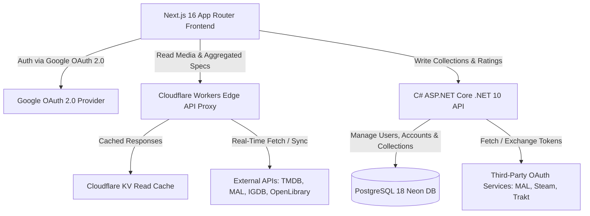

# Favorites Platform - Global Architecture & Engineering Standards

Welcome to the central architectural specification for Favorites, a high-performance, unified media tracking and API aggregator platform designed to organize and monitor consumption across diverse media formats (Movies, Anime, TV Series, Books, Manga, and Video Games) in a scalable monorepo environment.

## Documentation Navigation Matrix

| Specification | Description | Document Link |
| :--- | :--- | :--- |
| **Global Baseline** | System architecture, monorepo setup, Docker environment, and core engineering standards. | **[globals.md](./globals.md)** (Current Document) |
| **Frontend Architecture** | Next.js 16 (App Router), React 19, TypeScript 7.0 (ESNext), Bun runtime, TanStack Query v5, Axios. | **[frontend.md](./frontend.md)** |
| **Core API Architecture** | C# 14, ASP.NET Core .NET 10 API, Rigid DDD, Dapper, Serilog Global Logger, OOP Patterns. | **[api.md](./api.md)** |
| **Database Architecture** | PostgreSQL 18 (Neon DB), Lightweight schema, Dapper mapping, Unit of Work. | **[database.md](./database.md)** |
| **Workers & Edge Layer** | Cloudflare Workers API Proxy, Cloudflare KV read-caching, External Service Sync & Miniflare emulation. | **[workers.md](./workers.md)** |

---

## 1. Executive Summary & Architecture Overview

The Favorites platform addresses media fragmentation by acting as a lightweight **API Aggregator and Account Unifier**. Primary authentication is managed via **Google OAuth 2.0**. Users can link third-party accounts (MyAnimeList, AniList, Steam, Trakt) to sync existing libraries or manually curate mixed-media collections (e.g., a "The Witcher Franchise" collection containing books, video games, and TV series) under a single standardized rating (1.0 - 10.0) and dynamic status tracker ("Watching", "Reading", "Playing").

The system **does not store media metadata internally**. Cloudflare Workers act as an Edge API Proxy and aggregator, querying third-party APIs (TMDB, MyAnimeList, IGDB, OpenLibrary) in real-time, caching responses in Cloudflare KV, and returning normalized DTOs to the client.



---

## 2. Technology Stack & Precise Versions

| Component | Technology | Version | Purpose |
| :--- | :--- | :--- | :--- |
| **Monorepo Manager** | Bun | `>= 1.2.0` | Package manager, workspace orchestrator, script runner |
| **Containerization** | Docker / Docker Compose | `v2 (Compose 3.8)` | Local containerized development & deployment environments |
| **Identity & Auth** | Google OAuth 2.0 / JWT | Standard | Core user authentication, identity verification, and session management |
| **Frontend Engine** | Next.js (App Router) | `16.x` (React 19) | Server Components, Turbopack default, ISR rendering, SEO |
| **Language Compiler** | TypeScript | `7.0.x` (ESNext / TSNext) | Go-powered compiler, strict type checking, ESNext targets |
| **Data Fetching** | TanStack Query / Axios | `v5` / `v1.x` | Reactive caching, central key factories, HTTP transport |
| **Styling & UI** | Tailwind CSS / Headless UI | `v4` / `v2` | Utility-first styling & accessible unstyled primitives |
| **Design System** | Google Stitch MCP | Latest | UI component mockup generation & design token syncing |
| **Core API** | C# / ASP.NET Core | `.NET 10` (C# 14) | Rigid DDD business logic, user collections, account integrations |
| **Global Logger** | Serilog | `v4.x` | Structured JSON logging across all backend layers |
| **Data Access** | Dapper | `v2.x` | High-performance micro-ORM for explicit SQL queries |
| **Database** | PostgreSQL | `18` (Neon DB) | Lightweight relational engine storing Users, Linked Accounts, and Collections |
| **Edge API Proxy** | Cloudflare Workers | `Wrangler v3` | API Proxy, payload normalizer, library sync, and edge caching |
| **Edge Cache** | Cloudflare KV | Native Bindings | Low-latency key-value read-cache for external API payloads & searches |
| **Object Storage** | Cloudflare R2 | S3-Compatible | Storage for user avatars and fallback media assets |

---

## 3. Paradigm Separation & Engineering Principles

### 3.1 Backend: Strict Object-Oriented Programming (OOP)
All C# backend code across `api.md` and `database.md` adheres strictly to pure Object-Oriented Programming and Domain-Driven Design (DDD). Functional programming abstractions are not mixed into C# domain logic. Explicit GoF / Refactoring Guru design patterns are implemented:
- **Repository & Unit of Work Patterns**: Encapsulating Dapper data access for Users, Linked Accounts, and Collections.
- **Factory Pattern**: Creating Aggregate Roots and Domain Entities in valid states.
- **Strategy Pattern**: Encapsulating provider-specific API normalization and external token refresh rules.
- **Domain Events / Observer Pattern**: Handling side effects upon entity mutations (e.g., syncing linked accounts).

### 3.2 Frontend: Strict Functional Programming (FP)
All React and TypeScript frontend code across `frontend.md` adheres strictly to pure Functional Programming principles:
- **Pure Functions & Immutability**: All custom hooks, utility logic, and state transformations are pure.
- **Function Components Only**: Class components are strictly forbidden.
- **Headless Logic via Custom Hooks**: UI components render view logic while custom hooks encapsulate state.
- **Compound Components Pattern**: Building modular UI component trees without prop-drilling.
- **Pragmatic JS Loops**: Standard `for` or `for...of` loops are used where FP array methods or recursion cause unnecessary performance overhead, avoiding heavy third-party FP libraries.

---

## 4. Monorepo Structure & Bun Orchestration

The project is structured as a single Git repository containing all platform tiers:

```text
favorites-project/
├── .git/                      # Root Git repository
├── .gitignore                 # Consolidated monorepo gitignore
├── docker-compose.yml         # Local Docker environment orchestrator (PostgreSQL 18)
├── package.json               # Bun root workspace & task runner scripts (TypeScript 7.0)
├── resources/
│   └── docs/                  # Architecture & engineering specifications
│       ├── globals.md         # Master baseline (this file)
│       ├── frontend.md        # Next.js 16 frontend architecture & TODOs
│       ├── api.md             # ASP.NET Core .NET 10 (C# 14) API architecture & TODOs
│       ├── database.md        # PostgreSQL 18 & Dapper specification & TODOs
│       └── workers.md         # Cloudflare Workers & KV/R2 architecture & TODOs
├── frontend/                  # Next.js 16 application package
├── api/                       # .NET 10 C# solution (Favorites.sln)
└── workers/                   # Cloudflare Workers package & Wrangler configs
```

### Bun Command Palette (`package.json` scripts)
- **`bun dev:frontend`**: Launches Next.js 16 dev server on port `3000`.
- **`bun dev:api`**: Launches ASP.NET Core API with `dotnet watch` on port `5000`.
- **`bun dev:workers`**: Launches Cloudflare Workers dev server via Miniflare on port `8787`.
- **`bun docker:up`**: Spins up the full Docker container stack (`postgres:18-alpine`, `miniflare`, `api`, `frontend`).
- **`bun docker:down`**: Gracefully stops all container services.
- **`bun test`**: Runs unit and integration test suites across all packages.

---

## 5. Docker Environment & Local Services Setup

The platform utilizes a containerized environment managed via `docker-compose.yml` to replicate production behavior locally:

1. **`postgres` (PostgreSQL 18)**: Emulates the Neon Serverless PostgreSQL instance on port `5432` storing users, linked tokens, and collections.
2. **`miniflare` (Cloudflare Emulator)**: Runs Miniflare to emulate Cloudflare Workers (API Proxy) and KV namespaces locally on ports `8787` and `8788`.
3. **`api` (.NET 10 Web API)**: Runs the C# 14 backend container connected to `postgres` and `miniflare`.
4. **`frontend` (Next.js 16)**: Runs the frontend web client configured with environment variables targeting Google OAuth 2.0, local API, and Worker endpoints.

---

## 6. Global Standards & Repository Guidelines

1. **Documentation Language**: English is the mandatory language for all architecture docs, code comments, commit messages, and pull requests.
2. **No Emojis**: Emojis are prohibited in all technical documentation files.
3. **Relative Linking**: All cross-references between documentation files must use explicit relative links (e.g., `[Database Specs](./database.md)`).
4. **Commit Convention**: Conventional Commits style (`feat:`, `fix:`, `docs:`, `chore:`, `refactor:`, `test:`).
5. **Git Branching Strategy**: `main` branch for production-ready code, feature branches named `feature/<feature-name>`, and hotfixes `hotfix/<fix-name>`.
